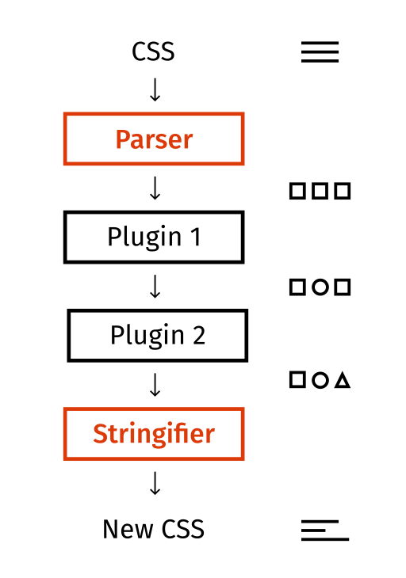

https://postcss.org/

https://postcss.org/docs/postcss-architecture

[TOC]

# PostCSS Architecture

PostCSS 架构的总体概述。对于每个希望为核心做出贡献或更好地理解该工具的人来说，它都是有用的。

## Overview

#### PostCSS

**不是像 Sass 或 Less 这样的样式预处理器。**

它没有定义自定义语法和语义，它实际上不是一种语言。 PostCSS 与 CSS 一起使用，并且可以轻松地与上述工具集成。也就是说，任何有效的 CSS 都可以由 PostCSS 处理。

**是CSS语法转换的工具**

它允许您定义自定义 CSS 之类的语法，这些语法可以被插件理解和转换。话虽这么说，PostCSS 并不是严格意义上的 CSS 规范，而是 CSS 的语法定义方式。通过这种方式，您可以定义自定义语法结构，例如 at-rule，这对于围绕 PostCSS 构建工具非常有帮助。 PostCSS 扮演着构建 CSS 操作优秀工具的框架的角色。

**是 CSS 生态系统的重要参与者**

在 PostCSS 生态系统上构建了大量可爱的工具，如 Autoprefixer、Stylelint、CSSnano。您很有可能已经隐式使用它，只需检查您的node_modules

#### Workflow

这是整个 PostCSS 工作流程的高级概述



从上图中可以看出，PostCSS 架构非常简单，但其中的某些部分可能会被误解。

你可以看到一个叫做 Parser 的部分，这个结构将在稍后详细描述，现在把它想象成一个可以理解你的 CSS 语法并创建它的对象表示的结构。

话虽如此，编写解析器的方法很少。

* *写入一个包含字符串到 AST 转换的文件*

  这种方法很流行，例如Rework分析器就是用这种风格编写的。但如果代码库很大，代码就会变得难以阅读并且速度相当慢。

* *将其拆分为词法分析/解析步骤（源字符串 → 标记 → AST）*

  这是我们在 PostCSS 中的做法，也是最流行的一种。很多解析器比如@babel/parser（Babel背后的解析器）、CSSTree都是这样写的。将标记化与解析步骤分开的主要原因是性能和抽象复杂性。

我们来思考一下为什么第二种方式更能满足我们的需求。

首先，因为字符串到标记步骤比解析步骤花费更多时间。我们对大型源字符串进行操作并逐个字符地处理它，这就是为什么它在性能方面是非常低效的操作，我们应该只执行一次。

但从其他侧 token 到 AST 的转换在逻辑上更加复杂，因此通过这种分离，我们可以编写非常快的 tokenizer（但有时难以阅读代码）和易于阅读（但速度慢）的解析器。

总结起来分为两个步骤可以提高性能和代码可读性。

现在让我们更仔细地了解在 PostCSS 工作流程中起主要作用的结构。


#### Core Structures

###### Tokenizer lib/tokenize.js

Tokenizer（又名 Lexer）在语法分析中发挥着重要作用。

它接受 CSS 字符串并返回标记列表。

标记是一个简单的结构，描述语法的某些部分，如规则、注释或单词。它还可以包含更多描述性错误的位置信息。

例如，如果我们考虑遵循 CSS

```css
.className { color: #FFF; }
```

PostCSS 的相应标记将是

```
[
    ["word", ".className", 1, 1, 1, 10]
    ["space", " "]
    ["{", "{", 1, 12]
    ["space", " "]
    ["word", "color", 1, 14, 1, 18]
    [":", ":", 1, 19]
    ["space", " "]
    ["word", "#FFF" , 1, 21, 1, 23]
    [";", ";", 1, 24]
    ["space", " "]
    ["}", "}", 1, 26]
]
```

正如您从上面的示例中看到的，表示为列表的单个标记和空间标记没有位置信息。

让我们更仔细地研究单个标记（如单词）。正如所说，每个令牌都代表一个列表并遵循这种模式。

```js
const token = [
     // represents token type
    'word',

    // represents matched word
    '.className',

    // This two numbers represent start position of token.
    // It is optional value as we saw in the example above,
    // tokens like `space` don't have such information.

    // Here the first number is line number and the second one is corresponding column.
    1, 1,

    // Next two numbers also optional and represent end position for multichar tokens like this one. Numbers follow same rule as was described above
    1, 10
]
```

标记化的实现方式有很多种，PostCSS 的座右铭是性能和简单性。 Tokenization 是一个复杂的计算操作，需要大量的语法分析时间（~90%），这就是为什么 PostCSS 的 Tokenizer 看起来很脏，但它针对速度进行了优化。任何高级构造（例如类）都可能会大大减慢分词器的速度。

PostCSS 的 Tokenizer 使用某种流/链接 API，您可以在其中向解析器公开 nextToken() 方法。通过这种方式，我们为解析器提供了一个干净的接口，并通过仅存储几个标记而不是整个标记列表来减少内存使用。

###### Parser lib/parse.js, lib/parser.js

Parser是负责传入CSS语法分析的主要结构。解析器生成一个称为抽象语法树（AST）的结构，稍后可以通过插件对其进行转换。

解析器与 Tokenizer 共同工作，并且对标记进行操作，而不是对源字符串进行操作，因为这将是一个非常低效的操作。

它主要使用 Tokenizer 提供的 nextToken 和 back 方法来获取单个或多个 token，然后构造称为 Node 的 AST 部分。

PostCSS 可以生成多种 Node 类型，但它们都继承自 Node 基类。

###### Processor lib/processor.js

处理器是一个非常简单的结构，用于初始化插件并运行语法转换

它仅公开一些公共 API 方法。它们的描述可以在 API 上找到

###### Stringifier lib/stringify.js, lib/stringifier.js

Stringifier 是一个基类，它将修改后的 AST 转换为纯 CSS 字符串。 Stringifier 从提供的 Node 开始遍历 AST，并调用相应的方法生成它的原始字符串表示形式。

最重要的方法是 Stringifier.stringify ，它接受初始 Node 和分号指示符。您可以通过检查 stringifier.js 了解更多信息

https://postcss.org/api/